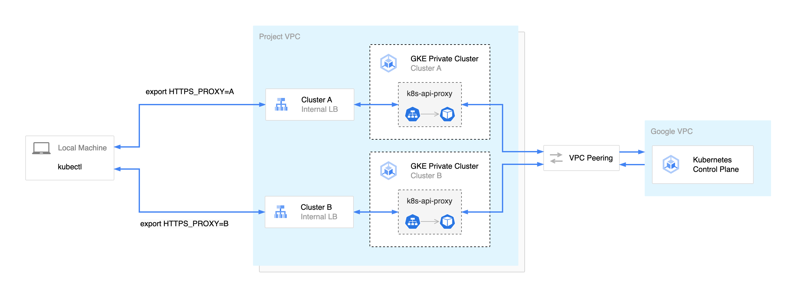
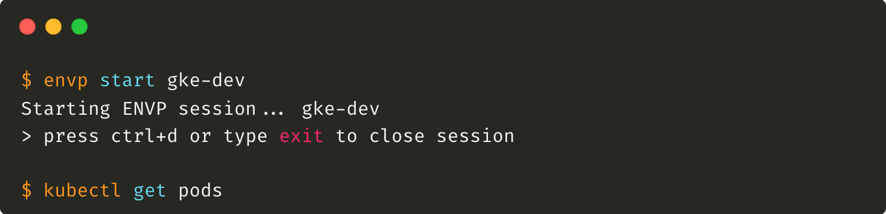

# Introduction to ENVP

[ENVP](https://github.com/sunggun-yu/envp) is a shell wrapper command-line tool for macOS and Linux that enables you to run commands or shells with specific environment variable configurations based on profiles. It also allows you to run scripts to set up these profiles. With ENVP, you can easily switch between different environment configurations, even simultaneously in different terminal windows. This tool provides a convenient way to manage and control your environment variables for various development and testing scenarios.

One of the key motivations behind developing ENVP was the need to manage a large number of GKE private clusters. Each private GKE cluster requires the HTTPS_PROXY environment variable to be set for k8s-api-proxy to access it from my local machine.



> For more detailed information on Creating GKE private clusters with network proxies for controller access, you can refer to the [Google Cloud documentation](https://cloud.google.com/kubernetes-engine/docs/archive/creating-kubernetes-engine-private-clusters-with-net-proxies).

However, switching between clusters meant manually unsetting and exporting the environment variable each time. also, you need to memorize or, copy and paste the proxy URLs.

```bash
unset HTTPS_PROXY
export HTTPS_PROXY=http://10.1.2.10:443
```

To simplify this process, I developed ENVP, which enables you to create profiles and easily set the HTTPS_PROXY value as k8s-api-proxy for each GKE private cluster in a YAML file. Let's dive into how ENVP has been making my DevOps life easier.

Here's an example of how I set up profiles using ENVP,

```yaml
profiles:
  gke-dev:
    desc: GKE proxy for dev cluster
    env:
    - name: HTTPS_PROXY
      value: http://10.1.1.10:443
    - name: NO_PROXY
      value: localhost,127.0.0.1,.googleapis.com
    - name: KUBECONFIG
      value: $HOME/.kube/gke-dev
  gke-test:
    desc: GKE proxy for test cluster
    env:
    - name: HTTPS_PROXY
      value: http://10.1.2.10:443
    - name: NO_PROXY
      value: localhost,127.0.0.1,.googleapis.com
    - name: KUBECONFIG
      value: $HOME/.kube/gke-test
  gke-qa:
    desc: GKE proxy for qa cluster
    env:
    - name: HTTPS_PROXY
      value: http://10.1.3.10:443
    - name: NO_PROXY
      value: localhost,127.0.0.1,.googleapis.com
    - name: KUBECONFIG
      value: $HOME/.kube/gke-qa
```

I have 3 example profiles,

- `gke-dev`
- `gke-test`
- `gke-qa`

and each profile has the same environment variables but different values,

- `HTTPS_PROXY` : k8s-api-proxy IP and port for each cluster
- `NO_PROXY`: HTTP_PROXY routes all your HTTP/HTTPS traffic to the proxy. and in some cases, some egress is blocked on the proxy side. by adding necessary endpoints in the NO_PROXY you can avoid connection issues
- `KUBECONFIG`: If you've configured your kubeconfig in the target file, you can also set the KUBECONFIG environment variable.

To initiate a new Shell session with the gke-dev environment variables, simply type the following command in your preferred terminal:

```bash
envp start gke-dev
```

then, it will create a new Shell session configured with your desired environment variable settings.



To switch to another profile, you can execute the command with the name of the desired profile in a new terminal window or after closing the session in the same terminal.

```bash
envp start gke-qa
```

> 💡 Tip: You can also simultaneously run the same command with identical environment variables but different values by leveraging ENVP profiles in combination with iTerm's Broadcast Input feature.


